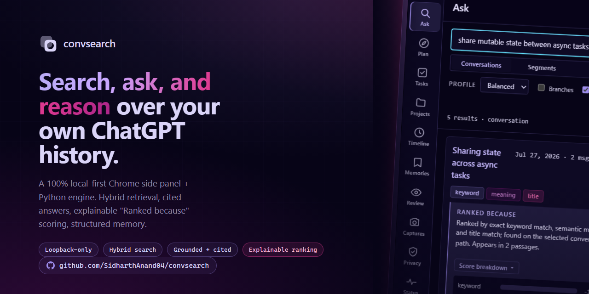
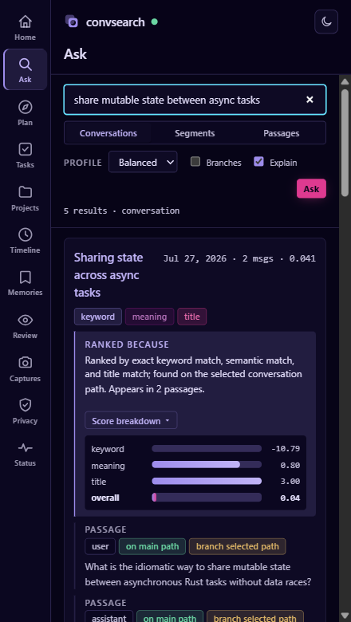
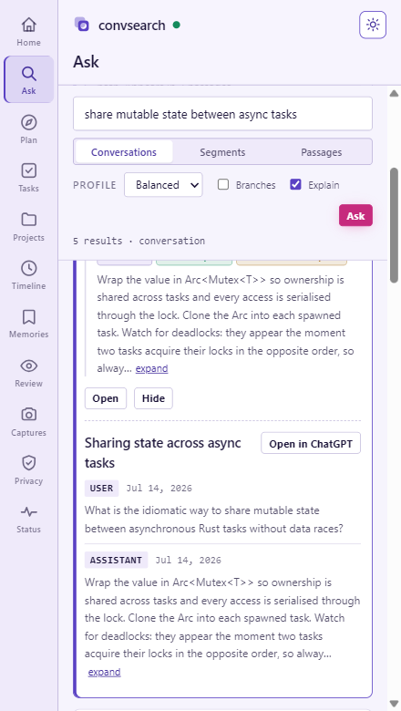
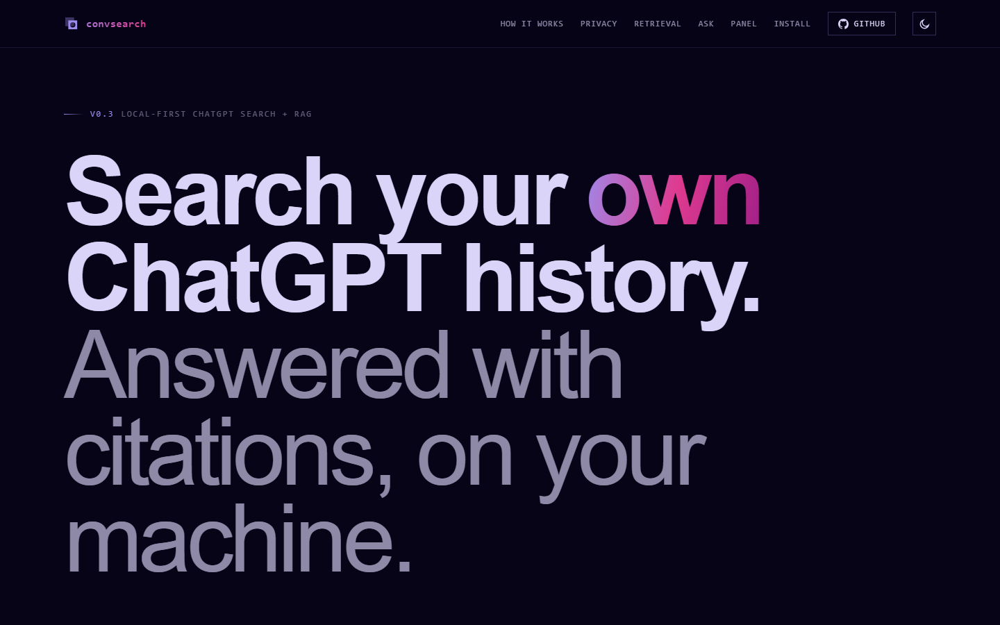

# convsearch

**Your ChatGPT history remembers what you decided. convsearch tells you what changed.**

[](https://github.com/SidharthAnand04/convsearch/actions/workflows/ci.yml)
[](LICENSE)
[](https://www.python.org/downloads/)

[Live site](https://convsearch.vercel.app) · [GitHub](https://github.com/SidharthAnand04/convsearch)




[Watch the full clip](docs/screenshots/demo.webm)

## What it is

ChatGPT can search your conversations. It cannot tell you that the storage
decision you made in March was reversed in June, that the reversal contradicts a
constraint you set in April, or that four tasks from that thread are still open.
That history is a black hole: everything you decided is in there, and none of it
is answerable.

convsearch reads your ChatGPT history and builds a **structured memory** of it —
decisions, tasks, preferences, risks, constraints, and open questions — then
tracks how each one changed over time. Nothing is ever overwritten. A reversed
decision is marked *superseded* and keeps a traceable link to what replaced it;
two conflicting decisions are marked *contested* rather than silently resolved.

On top of that it reconstructs a per-project workspace: architecture, decisions
including the superseded ones, open and completed tasks, rejected alternatives,
risks, and a timeline. Ask it *"what did we decide, what changed, and what's
next"* and you get an answer with citations pointing at the exact messages.

Everything runs on your machine. It also keeps working after you cancel your
subscription, get locked out, or leave a Team workspace.

> **Pre-1.0.** The CLI surface, the HTTP API, and the workspace schema may all
> change in a minor release.

## Why not just use ChatGPT's search

Use it — it's good at finding a conversation. convsearch answers a different
question. Search finds *where something was said*; convsearch tells you *what
the current state of a decision is, and how it got there*. It runs offline over
data you own, and searches message bodies with hybrid retrieval that keeps
identifiers like `conversations.json` and `IndexFlatIP` intact instead of
tokenising them into mush.

## Highlights

- **Live capture, no export required** — install the Chrome extension, run the
  local server, and every conversation you open on chatgpt.com is captured and
  auto-indexed on the spot. Importing a ChatGPT export ZIP is optional and only
  backfills your existing history faster.
- **Hybrid search** — lexical (SQLite + FTS5) and semantic (FAISS `IndexFlatIP`
  over local `BAAI/bge-small-en-v1.5` embeddings) run as independent channels,
  fused with Reciprocal Rank Fusion, with an optional local cross-encoder rerank.
- **Grounded, cited answers** — `ask` and `plan` write prose that points back at
  the exact messages it drew from, never a floating summary.
- **First-class explainable ranking** — every result shows a "Ranked because…"
  reason and a legible per-passage score breakdown, on by default in the panel.
- **Hierarchical retrieval** — search whole conversations, topic segments, or
  individual passages, your choice per query.
- **Structured, never-overwrite memory** — decisions, tasks, constraints, risks,
  and open questions with supersession and contested-state tracking, plus
  per-project reconstruction (architecture, timeline, rejected alternatives).
- **Read-only query planner** — a deterministic planner turns a question into
  retrieval steps with no writes and no surprises.
- **Local learn loop** — your own searches and clicks boost future ranking and
  distil into durable learned preferences, all on-device.
- **Chrome side panel** — a left icon rail (Home, Ask, Plan, Tasks, Projects,
  Timeline, Memories, Review, Captures, Privacy, Status), a light/dark theme
  toggle (dark by default, persisted), a universal command bar, and a
  right-click "Search convsearch for…".
- **Auto-index only** — indexing happens automatically after captures and catches
  up unindexed content on startup. There's no rebuild step in the normal flow.
- **Local and private** — retrieval, embedding, and indexing never leave your
  machine, and there is no telemetry.

## Quick start

Requires **Python 3.12+** and [uv](https://docs.astral.sh/uv/).

**1. Install the engine.**

```bash
uv sync --extra ml --extra llm
```

**2. Start the local server.** No export is needed — this creates an empty
workspace and serves it on `http://127.0.0.1:8756` so the extension can connect.

macOS / Linux:

```bash
bash scripts/convsearch-up.sh
```

Windows (PowerShell):

```powershell
powershell -File scripts/convsearch-up.ps1
```

**3. Load the extension.** Open `chrome://extensions`, turn on **Developer
mode**, click **Load unpacked**, and choose this repo's `extension/` folder.
Open the side panel from the extensions menu.

**4. Browse chatgpt.com.** With the server running, every conversation you open
is captured and indexed automatically — no re-exporting, no manual rebuild.
Search, ask, and the project/timeline views fill in as you go.

**Optional — backfill your existing history.** To seed the workspace with
everything you've already discussed, export your data (ChatGPT → Settings → Data
controls → Export) and pass the ZIP to the launcher:

```bash
bash scripts/convsearch-up.sh ./workspace <your-export.zip>
```

```powershell
powershell -File scripts/convsearch-up.ps1 .\workspace <your-export.zip>
```

The export is a one-time accelerator, not a prerequisite — live capture is the
primary path.

**Optional — written answers.** `ask` and `plan` generate grounded prose only
when a model is reachable. Install [Ollama](https://ollama.com) for a fully
local backend:

```bash
ollama serve && ollama pull gemma3:1b
```

`gemma3:1b` runs anywhere but is small; for noticeably better grounded answers,
`ollama pull llama3.2:3b` and set `llm.model` in `workspace/config.yaml`. Or set
`ANTHROPIC_API_KEY` to use the cloud backend. Indexing and embedding always stay
local; without any model, retrieval still works.

## Screenshots

**Side panel, dark theme (default).** A result with its "Ranked because"
explanation and per-passage score breakdown.


**Side panel, light theme.** The theme toggle in the header flips the whole
panel; the choice is persisted.



**Landing.** The project overview page.



## How it works

```
Chrome extension side panel
        │  HTTP (loopback only)
        ▼
Local server ──► 127.0.0.1:8756  (stdlib http.server, strict CORS)
        │
        ▼
Workspace on disk: SQLite + FTS5, FAISS vectors, and a memory graph
```

The extension talks only to the loopback server through its background service
worker, never to the network directly, and server text is rendered with
`textContent`, never `innerHTML`. Retrieval runs three independent channels —
lexical (FTS5), semantic (FAISS over local embeddings), and title — fuses them
with Reciprocal Rank Fusion, optionally reranks with a local cross-encoder, then
aggregates into conversation, segment, or passage results.

## Command reference

Every command takes `--workspace` / `-w`. Top-level commands and command groups:

| Command | What it does |
| --- | --- |
| `init` | Create a new workspace. |
| `import` | Load a ChatGPT export ZIP or `conversations.json` (optional backfill). |
| `index` | Build lexical + vector indexes (recovery only; capture auto-indexes). |
| `search` | Hybrid search over conversations, segments, or passages. |
| `ask` | Grounded, cited answer to a question. |
| `plan` | Deterministic read-only query plan for a question. |
| `timeline` | Topic-scoped decision timeline: how an idea changed over time. |
| `digest` | Deterministic rolled-up summary of recent changes (`--since 7d`). |
| `segment` | Topic-segment a conversation. |
| `memories` | Structured memory group: `extract`, `list`, `search`, `show`, `review`, `confirm`, `invalidate`, `pin`. |
| `projects` | Project reconstruction group: `list`, `show`, `export`. |
| `tasks` | Task inbox group: `list`, `complete`, `reopen`. |
| `captures` | Live-capture group: `list`. |
| `learn` | Learn-loop group: `run`, `show`, `stats`, `clear`. |
| `migrate` | Apply pending workspace schema migrations. |
| `serve` | Start the loopback server for the extension (auto-indexes captures). |
| `status` / `stats` | Workspace health and counts. |
| `doctor` | Diagnose a workspace and suggest fixes. |
| `inspect` / `eval` | Developer inspection and synthetic evaluation groups. |

**LLM-assisted memory extraction (opt-in):**

```bash
convsearch memories extract -w ./workspace --llm --backend auto
```

`--llm` layers LLM-proposed memories on top of the deterministic rules-based
extractor, storing accepted proposals through the same dedup/supersession path;
`--backend` is `auto` (default), `ollama`, or `anthropic`. If no backend is
reachable it degrades cleanly to rules-only results.

## Upgrading an existing workspace

Run `convsearch migrate -w WS` once after pulling a release that adds
migrations. Commands refuse to run against a stale workspace rather than failing
deep inside a query, and tell you the exact fix. `convsearch serve` applies
migrations automatically on startup.

## Privacy

Local-first and loopback-only by design. Raw exports, SQLite data, FTS and FAISS
indexes, embedding models, and your interaction log all stay on your machine.
There is no telemetry.

The extension is only a frontend to a server you run yourself — which is what
makes the privacy claim checkable rather than a promise. `convsearch serve`
binds `127.0.0.1` only and echoes CORS back to extension origins plus
chatgpt.com, never `*`.

**There is no authentication. Never run it on `--host 0.0.0.0`** — that would
expose an unauthenticated read/write API for your entire history to the network.
Keep it on loopback. If you believe you've found a security issue, please open a
GitHub issue (omit sensitive details) or contact the maintainer rather than
disclosing it publicly.

Two paths can send text off the machine, and **both are off by default**:
`ask`/`plan` with `--backend anthropic`, and reranking configured with
`reranking.enabled = true` *and* `reranking.backend = "llm"` (the default
reranker is a local cross-encoder). Indexing and embedding are always local.

## Limitations

- The extension needs the local server running to do anything.
- Live capture reads ChatGPT's private DOM, so a redesign there can break it. It
  fails by capturing nothing, never by breaking the page, and only sees
  conversations you open, on the visible branch.
- Written answers need Ollama or an Anthropic key. Without one, retrieval still
  works but `ask`/`plan` can't generate prose.
- Only `conversations.json`-style exports are supported; attachments and
  non-text parts are ignored.
- The Playwright e2e suite currently runs on Windows only.

## Development

```bash
uv sync --extra ml --group dev
uv run ruff check . && uv run ruff format --check .
uv run mypy src
uv run pytest -m "not real_model and not integration"
```

Unit tests use deterministic local vectors and never download a model. The
Playwright end-to-end suite lives in `tests-e2e/` (`npx playwright test`,
Windows-only for now). When a change touches the workspace schema, add a
migration under the storage layer and a matching test — commands guard against
stale schemas via `convsearch migrate`. Contributions are welcome via pull
request against the GitHub repo; please run the checks above first.

## License

[Apache-2.0](LICENSE)
